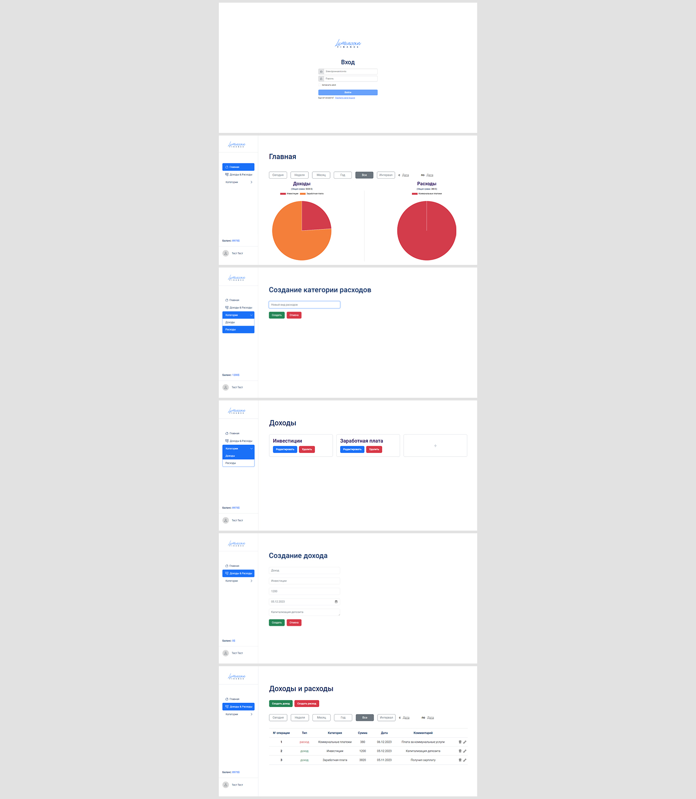

# Веб-приложение финансовый-менеджер (TypeScript)

Приложение для управления личными финансами (финансовый менеджер)  
**Год:** 2022

## Внешний вид

## Реализовано:
- SPA на TypeScript в соответствии с техническим заданием и макетом;
- Функционал финансового менеджера (регистрация/авторизация, задание баланса, создание финансовых операций, отображение операций, их фильтрация, визуализация диаграмм);
- Основные элементы SPA с использованием TypeScript (роутинг, шаблоны, сервисы и т.д.);
- Понятная валидации форма.

## Возможности:
* Регистрация, авторизация пользователя;
* Создание/удаление категории доходов или расходов;
* Добавление/удаление доходов или расходов;
* Сортировка отображения доходов/расходов в виде таблицы или в виде диаграмм;
* Установка баланса;
* Баланс изменяется в зависимости от доходов и расходов.

## Используемые технологии:
* HTML
* CSS (SCSS) + Bootstrap
* TypeScript
* Gulp
* WebPack
* JWT-Авторизация
* Postman